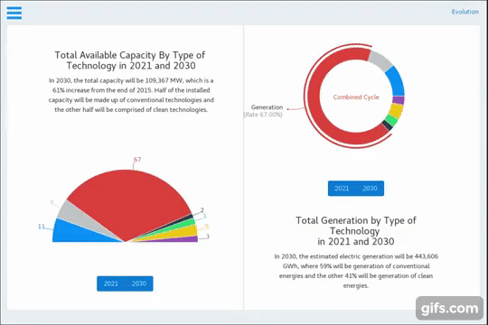

<h1>
  
  <h4>A capacity expansion model for the electricity sector.</h4>
   
</h1>

  
  
  

<h4>Preview</h4>

<h3>Download</h3>

Builds are available for <strong>macOS</strong>, <strong>Debian</strong> and <strong>Windows</strong>. Visit <a href="https://github.com/Switch-Mexico/SWITCH/releases">SWITCH GitHub Releases</a>

<h3>License</h3>

APACHE LICENSE, VERSION 2.0

